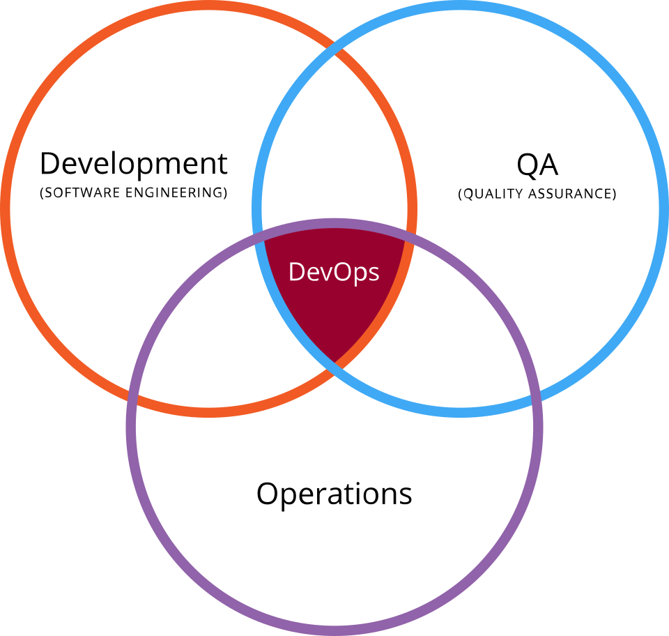

# ¿Qué es DevOps?

_DevOps_ es un conjunto de prácticas que integran el **desarrollo de software (Dev)** con las **operaciones de TI (Ops)**. Su objetivo es **acelerar el ciclo de vida del desarrollo de software** y permitir una **entrega continua de alta calidad**. Muchas de sus prácticas provienen de la **metodología Agile**, enfocándose en la colaboración, la transparencia y la mejora continua.

La característica central de _DevOps_ es la **automatización y el monitoreo** en todos los pasos de la construcción del software, desde la **integración**, las **pruebas**, el **despliegue**, hasta la **implementación** y la **gestión de la infraestructura**.

---

# Condiciones de DevOps

- Se entregará **código todos los días** o **varias veces al día**.
- Se debe **compilar** y **desplegar** en los servidores de **pruebas** y **producción**.
- Los servidores de **producción** son utilizados por los **clientes**, por lo que deben estar **siempre disponibles** y en funcionamiento[^1].

---

# Pipeline de entrega automatizada en DevOps

La entrega de software en DevOps se realiza mediante un **pipeline de entrega automatizada**, que sugiere pasos estructurados para garantizar calidad, rapidez y control. Los pasos típicos son:

1. **Ingeniería de requisitos**
    - Gestión de proyectos y tareas → _Jira, Trello_	
    - Desarrollo y configuración → _Visual Studio, Eclipse_	
    - Repositorio de código fuente → _Git, Bitbucket_	
2. **Etapa de Commit**    
    - Compilación del código → _Maven, Gradle_	
    - Pruebas unitarias → _JUnit, NUnit_	
    - Análisis estático de código → _SonarQube, ESLint_	
    - Empaquetado del software → _Docker, Maven_	
3. **Etapa de Aceptación**
    - Provisionamiento de entornos → _Terraform, Ansible_
    - Virtualización de servicios y sistemas de registro → _WireMock, MockServer_
    - Pruebas de aceptación → _Selenium, Cucumber_
4. **Etapa de Carga y Rendimiento**
    - Despliegue del software en entornos de prueba → _Kubernetes, Docker Compose_
    - Pruebas de carga → _JMeter, Gatling_
    - Pruebas de rendimiento → _New Relic, Prometheus_
    - Software listo para liberación
5. **Etapa de Liberación**
    - Despliegue final en producción → _AWS, Azure, Jenkins_

Esto es lo que se conoce como **“DevOps Delivery Pipeline”**, que permite entregar software de forma continua y segura.

---

# Ciclo de vida DevOps

## Desarrollo Continuo (Continuous Development)

En esta fase, los desarrolladores crean el código utilizando diversas herramientas de desarrollo y luego lo suben a un **sistema de control de versiones** (Source Code Management).
- Herramientas típicas: _Visual Studio, Eclipse, IntelliJ_
- Los ingenieros DevOps generalmente **no escriben código de aplicación**, pero son responsables de **mantener el código**, asegurando que se gestione correctamente mediante herramientas de control de versiones[^2].
### Sistema de control de versiones

Un _sistema de control de versiones_ es un software que **registra y gestiona los cambios** en archivos y directorios a lo largo del tiempo, permitiendo a los usuarios colaborar, comparar versiones y recuperar estados anteriores. 

Se utiliza principalmente para proyectos de desarrollo de software, pero también para cualquier tipo de archivo, y facilita el trabajo en equipo al permitir el **seguimiento de las modificaciones** de cada miembro.

Herramientas más utilizadas:
- **Git**
- Bitbucket
- Subversion
- GitLab
- Perforce

## Integración Continua (Continuous Integration)

La **Integración Continua** es la práctica de **combinar frecuentemente el código desarrollado por diferentes programadores** en un repositorio compartido, donde se realizan compilaciones automáticas y pruebas unitarias para detectar errores lo antes posible[^3].

Herramientas más utilizadas:

- **Jenkins**
- Bamboo
- CircleCI
- TeamCity

Pasos típicos en CI:
- **Pruebas unitarias** → _JUnit, NUnit_
- **Compilación del código** → _Maven, ANT, Gradle_
- **Análisis de código** → _Veracode, SonarQube_
- **Repositorio de artefactos** → _Nexus, Artifactory_

En el curso utilizaremos:
- **Pruebas unitarias:** JUnit
- **Análisis de código:** SonarQube
- **Compilación:** Maven
- **Repositorio de artefactos:** JFrog Artifact / DockerHub

## Despliegue Continuo (Continuous Deployment)

El **Despliegue Continuo** permite **entregar automáticamente el software probado en entornos de test, QA y producción**, reduciendo errores humanos y acelerando la entrega de valor a los usuarios.

Herramientas:
- **Ansible**
- Jenkins
- Travis CI
- Octopus Deploy

### Infraestructura

Para el despliegue continuo se necesitan entornos objetivos: test, QA y producción. 

Herramientas y plataformas:
- Docker
- **Kubernetes**
- **AWS**
- Azure
- Data Center tradicional

### Gestión de Configuración

Se utilizan herramientas de configuración para automatizar la administración de servidores y entornos:
- **Ansible**
- Chef
- SaltStack
- Puppet

## Pruebas Continuas (Continuous Testing)

El **Continuous Testing** es la práctica de ejecutar automáticamente pruebas de software a lo largo del pipeline de CI/CD, asegurando que el código cumpla con los requisitos y estándares de calidad.

Herramientas típicas:
- Selenium
- Apache JMeter
- Tricentis

> [!IMPORTANT]
> En el curso no trabajaremos directamente con estas herramientas, pero es importante conocer su función.

## Monitorización Continua (Continuous Monitoring)

La **Monitorización Continua** permite **vigilar el estado de las aplicaciones y la infraestructura** en producción y entornos de prueba, detectando problemas antes de que afecten al usuario final.

Herramientas:
- Nagios
- Zabbix
- **Prometheus**

---

🔙 [Volver al índice](00%20Índice.md)

[^1]: Mantener alta disponibilidad es uno de los principios clave de DevOps, ya que cualquier caída en producción afecta directamente a los usuarios.

[^2]: El control de versiones es fundamental en DevOps, ya que permite **seguimiento, colaboración y recuperación** de versiones anteriores de manera eficiente.

[^3]: La integración continua reduce conflictos entre desarrolladores y permite detectar errores temprano, aumentando la calidad del software.
