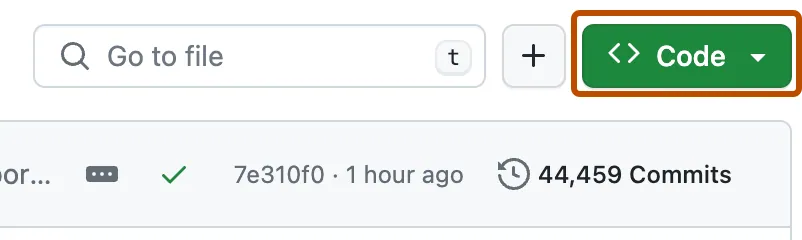

# 🧲 Clonar un repositorio

1. En GitHub, navega a la página principal del repositorio que quieras clonar.
2. Sobre la lista de archivos, haz clic en **<> Código**.  
	

3. Copia la URL del repositorio:
    - Para **HTTPS**, haz clic en 
    - Para **SSH**, selecciona _SSH_ y luego 
    - Para **GitHub CLI**, selecciona _GitHub CLI_ y luego 
	

4. Abre una **terminal**.
5. Cambia al directorio donde quieres clonar el repositorio.
6. Ejecuta:

```bash
git clone https://github.com/TU-USUARIO/TU-REPO
```

7. Presiona **Enter** y Git descargará el repositorio:

```bash
Cloning into 'mi-proyecto'...
remote: Counting objects: 10, done.
remote: Compressing objects: 100% (8/8), done.
remote: Total 10 (delta 1), reused 10 (delta 1)
Unpacking objects: 100% (10/10), done.
```

---

# ⬆️ Subir cambios a GitHub

Después de modificar o añadir archivos en tu repositorio local, sigue estos pasos:

## 1️⃣ Añadir cambios al _staging area_

```bash
git add .
```

## 2️⃣ Crear un commit

```bash
git commit -m "mensaje descriptivo del cambio"
```

## 3️⃣ Subir los cambios al repositorio remoto

```bash
git push
```

Si es la primera vez que haces push, es posible que Git te pida autenticación de GitHub (token o SSH).

---

# 🔄 Actualizar tu repositorio local

Cuando alguien más ha subido cambios a GitHub, o simplemente quieres sincronizar tu repo local:

## Obtener y fusionar cambios remotos automáticamente

```bash
git pull
```

Esto hace dos cosas:

1. **Descarga** los cambios del repositorio remoto
2. **Fusiona** esos cambios en tu rama actual

Si no hay cambios, verás algo como:

```
Already up to date.
```

---

Si quieres, puedo generar también la siguiente nota de la sección 2.3.3, o mejorar la estructura general del capítulo 2.3.